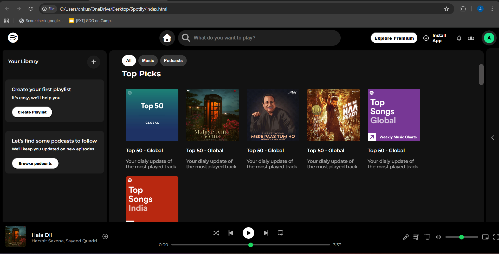
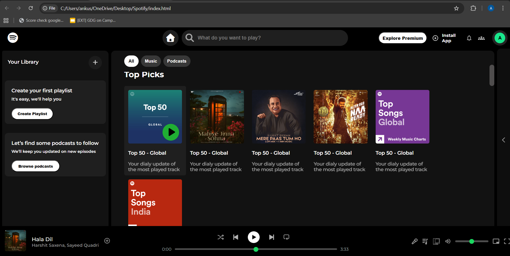

# 🎧 Spotify Web Player Clone

A Spotify-inspired web player UI clone built using **HTML and CSS only**, focusing on creating a clean, structured, and interactive frontend.

---

## 🚀 Live Demo

👉 https://your-live-link.com

---

## 📸 Preview




---

## 💡 Features

* 🎵 Spotify-like desktop UI (Sidebar, Header, Main Content, Music Player)
* 🎯 Smooth hover effects (Play button animation)
* 📊 Custom progress bar & volume slider styling
* 📌 Sticky header with scrollable content
* 🎨 Dark theme design
* 📱 Basic responsive behavior

---

## 🛠️ Tech Stack

* HTML5
* CSS3
* Flexbox
* Grid
* CSS Transitions & Hover Effects

---

## 🎯 What I Learned

* Structuring real-world UI layouts
* Mastering Flexbox and positioning
* Handling alignment and spacing issues
* Building interactive UI using only CSS
* Designing a polished frontend without frameworks

---

## ⚠️ Limitations

* Desktop-focused design
* Not fully responsive yet
* No JavaScript functionality (UI only)

---

## 🔮 Future Improvements

* Make the UI fully responsive
* Add JavaScript functionality (play/pause, interactions)
* Improve accessibility
* Refactor code for better scalability

---

## 📂 Project Structure

```bash
spotify-web-player-clone/
│── index.html
│── style.css
│── README.md
│── assets/
│   ├── images/
│   ├── icons/
│── screenshots/
│   ├── home-ui.png
│   ├── hover-play-button.png
```

---

## 🙌 Inspiration

This project is inspired by the **Spotify Web Player**, aiming to replicate its UI and understand real-world frontend design patterns.

---

## 👨‍💻 Author

**Ankush Shaw**
🎓 Student @ Narula Institute of Technology
💻 Aspiring Full Stack Developer

---

## 📬 Contact

* 🔗 LinkedIn: https://www.linkedin.com/in/ankush-shaw-091a26386/
* 💻 GitHub: https://github.com/ankush-shaw

---

## ⭐ Support

If you found this project helpful or interesting, consider giving it a ⭐ on GitHub!

---

## 🚀 Contribution

This is a personal learning project, but suggestions and improvements are always welcome!

---

## 📌 Note

This project is built for **learning purposes only** and is not affiliated with Spotify.
